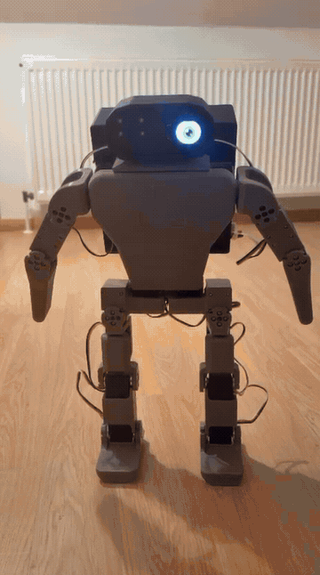
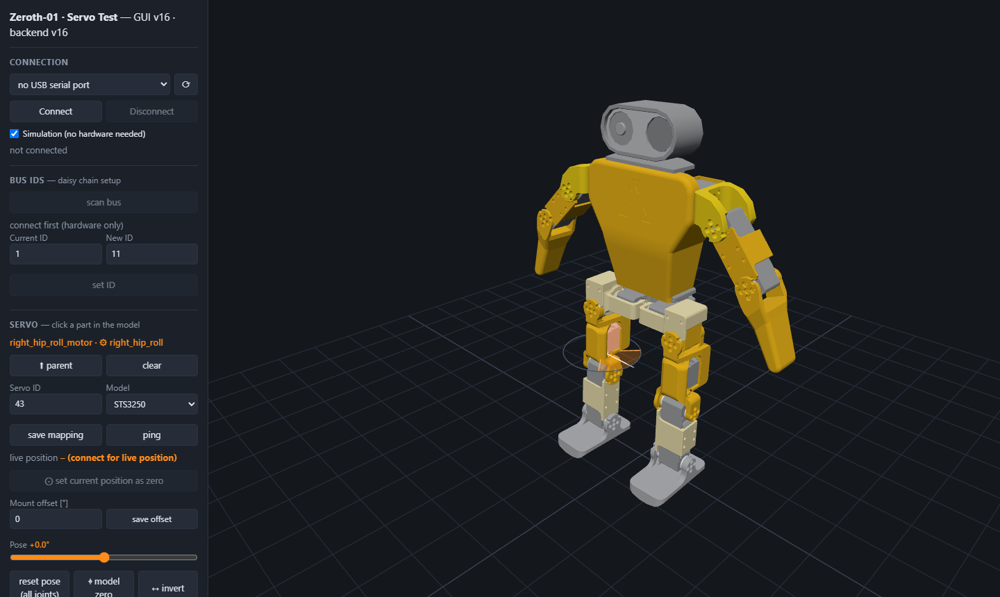

# Zeroth-01 Build

> Building the open-source Zeroth-01 humanoid — from 3D print to RL policy on real hardware.

[](LICENSE)
[](#build-log)
[](#this-build)

<!-- ─────────────────────────────────────────────────────────────
HERO SPOT — own footage only.
Currently: untethered push-ups, everything on board. Upgrade when
it walks on a trained policy (swap the GIF, keep the caption honest).
────────────────────────────────────────────────────────────── -->



*Untethered push-ups: no bench PSU, no USB cable. The 3S LiPo and the Raspberry Pi ride in the [backpack](hardware/backpack_v2/), the Pi executes the taught-in sequence locally and the browser only sends the intent. The left eye is a round LCD driven by the head IMU, the right eye is the Camera Module 3 — its live stream is the window open on the laptop in the background (≈7× time-lapse).*

> 🚧 **Current status:** whole body assembled & calibrated — all 16 servos on the daisy chain, per-joint limits & mount offsets measured, teach-in demos running **untethered** on battery and Wi-Fi. Head sensors are in: IMU display + camera. In simulation, five walking variants are trained on the CAD-accurate model. Next: **export and deploy the first policy on the robot, then measure the sim-to-real gap.**

Based on the **[Zeroth-01 by K-Scale Labs / Zeroth Robotics](https://github.com/zeroth-robotics/zeroth-bot)**. This repo documents my independent build of the platform and the software I write on top of it.

## What is the Zeroth-01?

A ~40 cm, 3D-printed, open-source humanoid robot platform designed for sim-to-real and reinforcement learning work, built around low-cost Feetech serial-bus servos.

Demo from the Zeroth-01 project (thumbnail links to YouTube):

[](https://www.youtube.com/watch?v=O6zqIltJcVw)

*The video above is external footage from the Zeroth-01 project, linked for context. Everything else in this repo is my own build.*

## Why this project

An end-to-end humanoid stack on affordable hardware, documented step by step: print & assemble → write the servo tooling (Python + C++) → train locomotion in simulation → deploy the policy on the real robot.

The goal is not just a finished robot, but a working sim-to-real pipeline with original tooling built along the way.

## This build

|                 |                                                        |
| --------------- | ------------------------------------------------------ |
| Platform        | K-Scale Zeroth-01 (~40 cm humanoid)                    |
| Actuators       | Feetech STS3215 (arms) · STS3250 (legs/torso, planned) |
| Onboard compute | Raspberry Pi 4 Model B Rev 1.5 (4 GB)                 |
| Head sensors    | Waveshare RP2040-LCD-1.28 (round LCD + QMI8658 IMU) in the left eye · Camera Module 3 in the right |
| Power           | 3S LiPo in the backpack, XY-CD63 low-voltage cutoff, Pololu buck for the Pi |
| Printing        | Bambu Lab P2S — PETG                                   |
| Training rig    | Linux workstation, 2× RTX 3090 (local, no cloud)       |

## Build log

- **Phase 0 — Printing** ✅ : all body parts printed in PETG on the Bambu Lab P2S — [print timelapse](media/print-timelapse.gif), print notes in [hardware/](hardware/)
- **Phase 1 — Arms** (STS3215) ✅ : assembled, IDs flashed (11–13 / 21–23), center-calibrated, per-joint safe limits measured on the bench (one torn elbow bracket later) — [hardware/joint_limits.json](hardware/joint_limits.json)
- **Phase 2 — Legs & torso** (STS3250) ✅ : **whole body assembled & calibrated** (IDs 31–35 / 41–45, mount offsets incl. a +90° hip, hand-trimmed zeros), **teach-in motion demos** running on the full body ([demos/](demos/)) — kneeling, waving, push-ups; the first whole-body sequences, still on the bench PSU, are in [this earlier clip](media/whole-body-demo.gif)
- **Servo test GUI** ✅ : browser tool for bring-up, testing, teach-in and visualization ([src/servo_gui/](src/servo_gui/), see [Software](#software))
- **Backpack (CAD → built)** ✅ : rear electronics housing for the 3S LiPo, XY-CD63 low-voltage cutoff, inline fuse, anti-spark switch, Waveshare adapter and Pololu buck, plus a torso insert that carries the Pi 4B in the now-empty battery bay — derived from the pinned CAD (torso hole pattern, interior cavity, arm/leg sweep envelopes); every part modelled with its connectors and wire zones, every cable as a tube with its minimum bend radius and checked against parts and envelopes; three support-free PETG parts, shown on the model in the GUI's *Attachments* panel incl. cables ([hardware/backpack_v2/](hardware/backpack_v2/)). **Printed, wired and in use** — it is what makes the robot untethered: the hero GIF above is running entirely off this pack
- **Head sensors** ✅ : the two eye sockets carry the electronics — a Waveshare RP2040-LCD-1.28 (round 1.28" LCD + QMI8658 IMU) on the left, a Camera Module 3 on the right. The LCD runs its own MicroPython firmware ([src/head_display/](src/head_display/)) that draws an animated eye and streams one IMU JSON line per frame over USB serial; the eye reacts to the robot's own attitude, so tipping the body moves the gaze. The camera is served as MJPEG on demand ([src/pi_service/head.py](src/pi_service/head.py)) — the first viewer starts `rpicam-vid`, the last one leaving stops it, so nothing runs while nobody is watching. Neither device sits on the servo bus, and a missing one is a status field rather than an exception
- **Onboard compute / wireless mode** ✅ : shared motion core ([src/zbot_core/](src/zbot_core/)) + intent service on the Raspberry Pi ([src/pi_service/](src/pi_service/)) — demos execute on the robot, the GUI switches between USB (bench) and wireless (Pi) mode; one-command deploy ([docs/pi-service.md](docs/pi-service.md))
- **Simulation model & walking policies** ✅ : MuJoCo model generated from the *built* robot rather than the upstream CAD — backpack geometry, datasheet masses from the stitched meshes and the head IMU in its real place and orientation. Five walking variants trained on it on the local GPU rig, with an unattended training queue and a checkpoint picker ([sim/](sim/README.md)). Export tooling is engine-independent, so the same Feetech model runs in the sim and on the robot
- **Phase 3 — Sim-to-real**: *next* — export a policy to ONNX, run it on the Pi and measure where the simulation and the real robot disagree

Milestones are tagged as releases (`v0.1-parts-printed`, `v0.2-arms-assembled`, `v0.3-first-motion`, …) so the build history is easy to follow chronologically.

## Software

Original code in this repo (as opposed to upstream — see [acknowledgements](#upstream--acknowledgements)):

### Servo test & visualization GUI — [src/servo_gui/](src/servo_gui/)

Browser-based tool (FastAPI + three.js) used to bring up and test the robot, built
around a **pinned OnShape CAD version** ([resources/cad/](resources/cad/)) so all
tooling refers to one immutable geometry state:


*Simulation mode with the calibrated model: select a leg joint, pose it with the slider (ground-contact display keeps the soles on the floor), then play the taught-in kneeling demo — the log streams limit clamping and load-sag compensation live (2.5× time-lapse).*

- **3D model, clickable** — select a servo in the CAD view; joint axes, rotation
  centers, zero references and the full kinematic tree are pulled from the OnShape
  assembly's mates, not guessed. Clicking a joint retrieves its configured bus ID;
  setting an ID auto-selects the matching joint
- **Bring-up & calibration** — bus scan, persistent ID flashing
  ([hardware/servo_ids.json](hardware/servo_ids.json)); live position readout of the
  selected servo; hand-turn the output and *set current position as zero* (mount
  offsets, e.g. a +90°-mounted hip, applied transparently everywhere)
- **Safety net** — per-joint limits ([hardware/joint_limits.json](hardware/joint_limits.json)),
  GUI-editable with left ↔ right mirroring and **enforced server-side** (every sweep
  and demo is clamped); *Stop* is always an E-stop; a watchdog re-parks holding
  joints that lose torque
- **Single & group runs** — sweep tests with a live 3D range gauge; group runs
  sequential (ascending ID) or simultaneous with presence detection (absent servos
  grayed out); **hold-center demo mode** keeps tested joints standing at center;
  load-sag compensation trims steady-state error so poses land where taught
- **Teach-in demos** — capture steps from the posed 3D model, from the
  **hand-posed real robot** (torque released) or as exact center; per-step and
  global speed/accel/pause; named sequences stored in [demos/](demos/), played back
  on hardware or in simulation (the model plays along live)
- **Grounded, calibrated visualization** — model zero pose calibrated to the real
  robot (display corrections + per-joint direction inversion), ground-contact
  heuristic that keeps the stance foot's sole flush on the floor ("gravity feel")
- **Simulation mode** — the full GUI works without hardware; version handshake
  warns loudly when frontend and backend get out of sync
- **Two operating modes** — *USB (local)*: adapter on the laptop, full bench
  tooling. *Wireless (Pi)*: adapter on the robot's Raspberry Pi; the browser
  sends **intents only** (play demo, stop, center, release, teach-in capture)
  to a Pi-side FastAPI service running the same shared motion core
  ([src/zbot_core/](src/zbot_core/)) — Wi-Fi jitter never sits inside a
  control loop, limits are enforced on the robot, and Stop is an E-stop in
  both modes. Teach-in works wirelessly too: hand-pose the robot, capture via
  the Pi, save — the repo stays canonical, the robot plays it immediately



*A clicked joint (`⚙ right_hip_roll`): the gauge ring sits on the CAD joint axis, the bus ID and min/max limits are retrieved from the repo configs, and the calibration tools (live position, re-zero, mount offset, model zero) are one click away.*

```
cd src/servo_gui
uv sync
uv run server.py        # -> http://127.0.0.1:8451
```

Details in [src/servo_gui/README.md](src/servo_gui/README.md); all conventions,
units, IDs and workflows are collected in the
**[User Manual](docs/User_Manual.md)**.

### Head display & camera — [src/head_display/](src/head_display/) · [src/pi_service/head.py](src/pi_service/head.py)

The head carries the two sensors that are *not* on the servo bus, one per eye socket.

- **Animated eye + IMU** — the left eye is a Waveshare RP2040-LCD-1.28, a round
  1.28" display with a QMI8658 IMU on the same board. It runs its own MicroPython
  firmware: every frame it draws the eye and streams one JSON line of telemetry
  over USB serial (acceleration in mg, rate in dps, temperature, supply voltage).
  Because the IMU sits behind the eye, the robot's attitude *is* the gaze — tip
  the body and the eye looks along. Moods (`neutral`, `happy`, `sleepy`,
  `surprised`), blinking and an explicit `look x y` are accepted as commands, so
  the head can react to what the motion engine is doing
- **Camera Module 3** — the right eye, served as MJPEG on demand. The first HTTP
  viewer starts `rpicam-vid`, the last one leaving stops it a few seconds later;
  nothing runs while nobody is watching. The GUI shows the stream next to the CAD
  model, which is how the robot's own view ends up on the laptop in the hero GIF
- **Never in the way of the servos** — both devices live in their own daemon
  threads with their own locks. A missing or unplugged one becomes a status field
  in `/status`, never an exception on the motion path

### Other

- **Python bench scripts** — first-contact servo test ([src/tests/](src/tests/))
- **C++ tooling** (next) — Feetech packet parser, tick ↔ radian conversion, RAII serial-port wrapper
- **Planned** — real-time servo control node (rclcpp) with ONNX Runtime policy inference on the Pi 4

## Simulation & RL

MuJoCo/ksim-based training pipeline: train locomotion policies locally on the GPU rig, export to ONNX, run inference on the robot.

The model is generated from **the robot that actually exists**, not from the upstream CAD ([sim/tools/build_model_cad.py](sim/tools/build_model_cad.py)): 16 DoF with the real servo IDs, the sys-ID'd STS3250/STS3215 actuator split, the backpack geometry, link masses derived from datasheet values and stitched mesh volumes, and the head IMU at its real position and orientation. That last detail matters more than it sounds — a policy that learns to balance on an IMU mounted somewhere the sensor is not will not transfer.

Five walking variants are trained on that model, driven by an unattended training queue with a checkpoint picker, so the GPU never idles between stages. The export path is engine-independent: the same Feetech actuator model runs in simulation and on the robot.

What is **not** done yet is the interesting part: none of these policies has run on the real robot. That is the next step, together with measuring where simulation and hardware disagree. Setup, stack decision (post-K-Scale-shutdown state of the ecosystem), the per-variant notes and the sim-to-real notes live in [sim/README.md](sim/README.md).

## Repository structure

```
docs/       dated build-log entries & decisions
hardware/   servo docs & configs (IDs, joint limits, mount offsets), print notes ·
            backpack_v2/ (CadQuery model + STLs of the electronics backpack)
demos/      teach-in motion sequences (JSON, created & played via the GUI)
src/        servo_gui/ (web GUI) · zbot_core/ (shared motion core) ·
            pi_service/ (onboard intent API) · head_display/ (MicroPython eye +
            IMU firmware) · tests/ (bench scripts) · cpp/ (planned)
resources/  pinned CAD snapshots (immutable OnShape version pins)
sim/        training configs, MJCF/URDF, sim-to-real notes
policies/   exported ONNX policies
media/      photos, print timelapses, hero GIF
```

## Lessons learned

*(Updated as the build progresses — print settings, servo quirks, sim-to-real gaps.)*

- **Why ~50 kg·cm servos are the ceiling for a 40 cm biped:** required joint torque scales roughly with L⁴ for geometrically similar robots — doubling size means ~16× the torque. That makes the STS3250 a hard limit at this scale; the next size class up requires Dynamixel-class actuators.

## Roadmap

> **▶ Next up: get a trained policy onto the robot and find out how far the simulation is off.**
> Five walking variants are trained on the CAD-accurate model and the export path is ready; nothing has run on hardware yet. The two steps below are the whole point of the project, and the second one is where the surprises live.
>
> 1. **Deploy the first policies** — export a checkpoint to ONNX, run inference on the Pi against the real servo bus, start on the tether/stand before the floor
> 2. **Measure the sim-to-real gap** — compare commanded vs. achieved joint angles, step timing and attitude between MuJoCo and the robot, and feed what differs back into the actuator model and the mass model rather than into reward tweaks

- [x] Build plan & repository
- [x] Print all body parts in PETG (Bambu Lab P2S)
- [x] Servo test & visualization GUI (FastAPI + three.js) on a pinned CAD version — joint axes, kinematics and safety limits from/against the CAD data
- [x] Bench bring-up of the arm servos (STS3215): daisy-chain IDs (11–13 / 21–23), comms verified, center calibration at tick 2048
- [x] Phase 1: assemble the arms → upper body assembled & calibrated, per-joint safe limits measured
- [x] First arm motion demos → new hero GIF
- [x] Phase 2 assembly: legs & torso (STS3250, IDs 31–35 / 41–45) → whole body assembled, calibrated (mount offsets, limits) — teach-in demos (kneeling, waving) run on the full body
- [x] Onboard the Raspberry Pi: shared motion core (`zbot_core`), Pi intent service with watchdog scaffold + one-command deploy, GUI wireless mode — demos run untethered from the laptop's USB port
- [x] Restore SSH/deploy access to the Pi: dev keys in the repo, one-command deploy working again
- [x] Head sensors: IMU display in the left eye, Camera Module 3 in the right — animated eye driven by the robot's own attitude, MJPEG stream on demand ([src/head_display/](src/head_display/))
- [x] Backpack built and wired: 3S LiPo, cutoff, fuse, buck and the Pi ride on the robot — demos run untethered on battery and Wi-Fi
- [x] Simulation setup: build-specific MJCF model (16 DoF, sys-ID'd Feetech actuators) running in MuJoCo/ksim — GPU training pipeline verified end-to-end ([sim/](sim/README.md))
- [x] Rebuild the model from the *built* robot: backpack geometry, datasheet masses, head IMU in its real pose
- [x] Train locomotion policies in simulation — five walking variants on an unattended training queue
- [ ] **Deploy the first policies on the robot** — export to ONNX, inference on the Pi against the real servo bus
- [ ] **Sim-to-real gap** — measure where MuJoCo and the hardware disagree (joint tracking, step timing, attitude) and correct the actuator/mass model, not the rewards
- [ ] C++ serial tooling against the bench setup: Feetech packet parser, tick ↔ radian conversion, RAII serial-port wrapper
- [ ] Real-time C++ control node (rclcpp) with ONNX Runtime inference on the Pi 4
- [ ] Phase 3: full integration — locomotion + arms

## Upstream & acknowledgements

This build stands on the open-source work of K-Scale Labs / Zeroth Robotics:

- [zeroth-robotics/zeroth-bot](https://github.com/zeroth-robotics/zeroth-bot) — the Zeroth-01 platform (hardware & docs)
- [kscalelabs/kos-zbot](https://github.com/kscalelabs/kos-zbot) — robot OS & hardware abstraction layer (Feetech drivers, calibration CLI)
- [kscalelabs/ksim](https://github.com/kscalelabs/ksim) — RL training library built on MuJoCo/JAX

See the upstream READMEs for the full ecosystem. This is an independent build log, not affiliated with K-Scale Labs.

## License

Original code and documentation in this repository: [MIT](LICENSE).
Upstream hardware, firmware, and design files remain under their respective upstream licenses.

---

Built by [Justin Riekehof](https://github.com/Justin-Riekehof) — simulation engineer (C++), working toward RL-based humanoid control.
