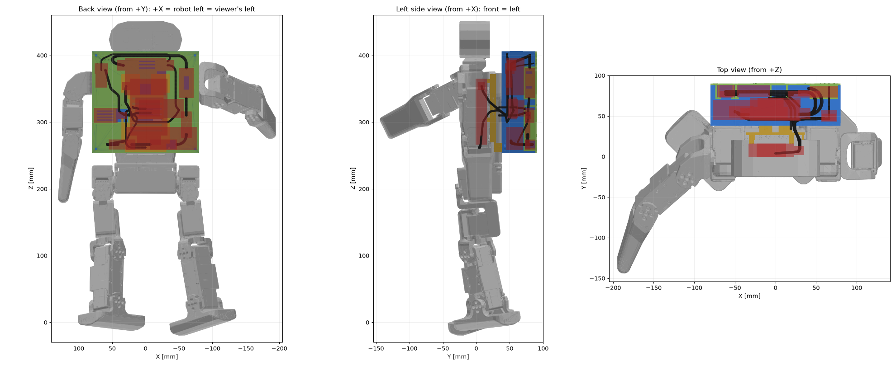

# Backpack — Elektronik-Aufsatz für den Torso (CAD)

Ersatz für den originalen K-Scale-BackPack, ausgelegt nach `zbot-backpack-spec` v2
(Sicherungspfad, Hardware-Unterspannungsabschaltung, akustischer Warner, separater
Buck-Regler, LiPo im Rucksack). Der Aufsatz nutzt **die vorhandene Backpack-Aufnahme am
Torso 1:1**; am Torso wird nichts geändert.

Zwei Stände liegen hier:

| Stand | Idee | Tiefe hinter der Rückwand | Dateien |
| --- | --- | --- | --- |
| **v3.1 (empfohlen)** | einlagig mit Kabellage; **Pi 4B auf einem Träger im Torso-Innenraum** (die Kammer des Original-Akkus / Electronics Mount / MilkV ist in diesem Build leer); alle Bauteile inkl. Stecker, Klemmen-Kabelzonen und Leitungen mit Biegeradius modelliert | **52 mm** | `backpack_v3.py`, `stl_v3/`, `check_cables.py` |
| v2 (Rückfallebene) | zweilagig, alles im Rucksack | 66,5 mm | `backpack_v2.py`, `stl/` |



**Ansehen in der Servo-WebUI:** `cd src/servo_gui && uv run server.py`, dann im Panel
**Attachments**: die drei Druckteile, jede Bauteil-Hülle (18, mit Stecker- und Kabelzonen)
und jedes Kabel (13) einzeln oder gruppenweise ein-/ausblenden; ein Klick auf ein Teil im
3D-Fenster zeigt seinen Namen; „torso see-through“ zeigt den Träger im Torso. Gelenke posen
wie gewohnt, der Rucksack ist am Torso-Link befestigt. Die WebUI liest
`resources/cad/attachments/manifest.json` und die GLBs daneben — **beides erzeugt
`viewer/export_attachments.py`** (Namen/Farben in dessen Tabellen; vorher `check_cables.py`
für die Kabel-STLs); ohne Manifest ist das Panel unsichtbar.

Koordinaten in diesem Dokument: **Roboter-Frame des gepinnten Assemblys** (mm):
+X = Roboter links, +Y = hinten, +Z = oben. Torso-Rückwand = Ebene **Y 38,1**.

---


## v4.6 (2026-09-22): Torso-Bohrungen Ø4,0

* Die vier Durchgangsbohrungen des Grundrahmens für die Torsoschrauben (±35,01 / 261,56 und ±47,24 / 330,34) haben
  jetzt **Ø4,0 mm** statt 3,4 (`D_TORSO_HOLE`) und die Senkung für den Zylinderkopf **Ø7,0 × 4,0 mm** statt 6,6 × 3,2
  (`D_TORSO_CB`, `H_TORSO_CB`) [Vorgabe]. Die Senkung geht durch den 3-mm-Dom und 1 mm in die Platte, unter dem Kopf
  bleiben 2 mm Platte, im Dom (Ø10) 1,5 mm Wand. Die Eckschrauben des Deckels bleiben bei Ø3,4 / Senkung 6,6 × 3,2.
  Nur der Grundrahmen ist neu.

## v4.5 (2026-09-22): Deckel — Cutoff-Lochabstand, Waveshare-Bohrungen, Sockel des Schaltereinsatzes

* **XY-CD63:** Die Bohrungen auf der langen Seite (x) lagen 1,5 mm zu weit auseinander [am Modul gemessen]:
  Abstand **58 → 56,5 mm** (`CUT_DX`), Löcher jetzt bei x ±28,25, mittig zum Modul; z 343,5 / 381,5 unverändert.
* **Waveshare-Sockel am Deckel:** Bohrung **Ø1,9 → Ø2,2** (`D_WS_BORE`, +0,3 mm) [Vorgabe]. Pololu-Dome und
  Schalterschrauben bleiben bei Ø1,9.
* **Hauptschalter-Einsatz:** Der Einsatz hat an seinen zwei Schrauben eigene Sockel Ø5 × 3 mm (gleiches Maß wie die
  Deckelpads) [Vorgabe]. Der Deckel bekommt dafür von außen zwei **Aussparungen Ø5,5 × 3,0 mm** (0,25 mm Spiel je
  Seite) an den Schraubpositionen (x −64, z 338,5 / 378,5), so liegt der Einsatz plan auf. Damit die Schrauben weiter
  greifen, sind die Innenpads von Ø5 × 3 auf **Ø7,5 × 6 mm** gewachsen: 2 mm Deckel + 6 mm Pad − 3 mm Aussparung =
  **5 mm Gewindelänge** wie bisher (Bohrung Ø1,9 durchgehend). Die Aussparungen berühren den Ausschnitt 15,5 × 34,5
  an einem Punkt (Sockelmitte 20 mm von der Schaltermitte, Ausschnitt-Ende 17,25). Der Ausschnitt geht jetzt durch die
  ganze Padhöhe, die Pads enden also am Ausschnitt und ragen nicht in den Einsatzkörper. Die Sockel sind als
  `placeholder_switch_bosses.stl` in der WebUI einblendbar.
* Das Schalter-Pigtail läuft wegen der höheren Pads bei y 96 statt 98 (Prüfung ohne Befund). Grundrahmen unverändert.

## v4.4 (2026-09-22): Pi um 180° gedreht — 35 mm für das Netzteil, 50 mm für USB-A, SD-Fenster rechts

* **Vorgaben:** vor der USB-C-Kante (Netzteil) mindestens **35 mm** gerade Platz für Stecker und Kabel, vor der
  Ethernet/USB-A-Kante **50 mm** für die Stecker. Außenmaße unverändert, Torsoschrauben müssen frei bleiben.
* **Warum die Lage v4.3 nicht reicht:** Dort zeigt die USB-C-Kante nach oben, bis zur Decke (z 413,5) sind es 15 mm
  (v4.2 rechnete mit einem 90°-Stecker). 35 mm unter der Decke zwingt die Platine auf z ≤ 378,5, damit läge sie auf
  dem Schraubdom der linken Torsoschraube (−47,2 / 330,3, Dom bis y 44,1, Platine ab y 43,1). Der Dom muss frei
  bleiben, sonst lässt sich der Rucksack nicht mehr vom Torso lösen (der Pi ist von der Torsoseite verschraubt).
  Eine Suche über alle vier Drehlagen und Positionen (`SD_GAP`, 35/50-mm-Zonen, Dome, Wanne) ergibt: SD-Kante −X mit
  USB-C oben hat keine Lösung, machbar sind nur SD-Kante +X mit USB-C unten (Pi quer) oder SD-Kante oben (Pi hochkant,
  Fenster in der Decke, Kameraschlitz und Servobus-Durchführung im Weg).
* **Neue Lage (Pi quer, um 180° gedreht):** x **−14…71**, z **337…393**. SD-Kante rechts (Roboter links, +X) mit
  6,5 mm zur Wand, das **microSD-Fenster liegt jetzt in der +X-Wand** (z 353…377, Form wie v4.3, gegenüber der
  LiPo-Schublade, die weiter unten bei z 256…294 sitzt). USB-C-Kante unten: **40,5 mm** bis zum Zwischenboden
  (Zone x 52,8…66,8, gerader Stecker, Kabel nach unten). Ethernet/USB-A nach −X: **50 mm** Steckerzone x −64…−14
  (bis zur Wand 63,5 mm), bei abgenommenem Deckel von hinten erreichbar. Die Platine liegt 1,7 mm über dem rechten
  Schraubdom (z 335,3), die Steckerzone 1,7 mm über dem linken. Lochbild: x 9,5 / 67,5, z 340,5 / 389,5; Lüftungsschlitze
  unter dem Pi auf x 15…62, z 346…381 mitgewandert.
* **Pololu** weicht dem Steckerraum aus: von (67 / 385) nach **(−63 / 308)** links unten, Pads oben (Kabelzone bis
  z 334, 0,8 mm neben dem linken Dom). Die **5-V-Messpins** im Deckel wandern nach x −60 / −54, z 325 (zwischen
  XT60-Cradle und Schalterpad).
* **Kabel neu:** 12 V OUT → Pololu an der Decke nach −X und an der −X-Wand hinunter (neben der Steckerzone); Pololu
  5 V → USB-C unten quer über die Dome (y 54) zum Stecker; Pi USB-A → Waveshare vom −X-Ende der Steckerzone vor dem
  Cutoff hinunter; Messleitungen kurz zum Deckel. Kameraband: aus dem Schlitz auf der Platte hinunter, über der
  Pi-Oberkante (z 395…411) nach +X, dort gefaltet und über die Platine (über der GPIO-Leiste) hinunter zur CSI-Buchse
  (26 / 348,5); als L-förmige Hülle modelliert.
* Unverändert: Deckel bis auf die Messpins und Beschriftung, Waveshare, Cutoff, Schalter, LiPo-Schublade, Torsoschnittstelle.

## v4.3 (2026-09-22): Pi 6 mm nach +X, microSD-Fenster in der rechten Seitenwand

* **Befund:** In v4.2 lag die SD-Kante des Pi (x −77) nur 0,5 mm vor der Innenfläche der −X-Wand (x −77,5). Die
  gesteckte microSD-Karte steht etwa 3 mm über die Platinenkante hinaus, der Pi ließ sich mit Karte nicht einbauen.
* **Pi um 6 mm nach +X verschoben** [Vorgabe: mindestens 6 mm, 3 mm Karte + 3 mm Aufmaß]: x **−71…14** (vorher −77…8),
  z unverändert 342,5…398,5. Abstand Platinenkante → Wand jetzt **6,5 mm** (`SD_GAP`). Außenmaße des Rucksacks
  unverändert (160 × 69 × 162), nur das M2-Lochbild mit Standoffs und Senkungen (x −67,5 / −9,5, z 346 / 395) wandert
  mit, ebenso die Steckerzone Ethernet/USB-A (jetzt x 14…42, davon bleiben 35 mm bis zur +X-Wand frei) und die
  USB-C-Zone (x −66,8…−52,8). Die Pi-Kabelpunkte in `CABLES` sind um 6 mm mitgezogen (USB-A → Waveshare, 5 V → USB-C).
  Geprüft: Lüftungsschlitze unter dem Pi (x −69…−20, z 352…387) und die Senkungen (z 343,8…348,3 / 392,8…397,3)
  überschneiden sich weiterhin nicht; die Servobus-Durchführung (x 11…22, z 300…335) liegt unter der Pi-Lage.
* **microSD-Fenster in der −X-Wand** (Roboter rechts, gegenüber der LiPo-Schublade) [Vorgabe]: Der Kartenschlitz des
  Pi 4B sitzt auf der Platinenunterseite mittig auf der 56-mm-Kante, die Karte liegt also zwischen Platte und Platine
  bei y ≈ 41,4…42,4, z ≈ 365…376. Fenster `sd_window_tool()`: 24 mm breit (z 358,5…382,5), Boden = Plattenoberkante
  y 41,1, 6,4 mm senkrecht, dann 45°-Dach auf einen 4-mm-First bei y 57,5 (Druck mit der Platte auf dem Bett ohne
  Support, keine Brücke > 4 mm), Ecken R 1, Eintrittskante außen 1 mm angefast. Die Karte wird durch das Fenster
  gesteckt und am 3-mm-Überstand gezogen; die Hülle `placeholder_pi_sd.stl` (Karte gesteckt) ist in der WebUI
  einblendbar und liegt kollisionsfrei im Fenster.
* Sonst unverändert: Deckel, Waveshare, Pololu, Cutoff, Schalter, LiPo-Schublade, Kabelwege. Druckdateien
  `print/pixel-backpack-v4_1-base.stl` neu, der Deckel ist identisch.

## v4.2 (2026-09-19): Pi quer, Waveshare am Deckel, Kameraschlitz, Pololu-Lochbild

* **Raspberry Pi quer, USB/Ethernet zur Mitte** [Vorgabe]: x −77…8, z 342,5…398,5. Die USB-A- und Ethernet-Stecker
  haben rechts 28 mm freien Raum (x 8…36) und sind bei abgenommenem Deckel von hinten erreichbar. Der Pi liegt
  oberhalb der linken Torsoschraube (−47,2 / 330,3). Im Stand v4 lag eine Pi-Ecke rund 1 mm auf deren Schraubdom und
  verdeckte die Schraube. Befestigung wie bisher von der Torsoseite mit M2, das Lochbild ist mitgedreht.
* **Netzteil über einen USB-C-Stecker mit 90°-Abgang** [Vorgabe]: 15-mm-Zone über dem linken Ende der Oberkante,
  Kabel nach hinten. Das 5-V-Kabel vom Pololu läuft unter der Decke hinter dem Kameraband dorthin.
* **Kamera-Flachband:** Schlitz 18 × 3 mm in der Grundplatte bei x −36,5…−18,5 / z 406,2…409,2, auf gleicher Achse
  und Höhe wie der Schlitz in der Kopf-Rückplatte (`hardware/head_cam/cam3_pose.json`). Der Rucksack (bis z 416)
  überlappt den Kopf in der Höhe, dazwischen (y 20…38) ist nur Luft. Das Band läuft also gerade von der Kamera in den
  Rucksack. Die CSI-Buchse des Pi liegt etwa 20 mm darunter (~x −32 / z 387).
* **Waveshare am Deckel** [Vorgabe]: Bauteilseite zum Torso, x 34,5…76,5, z 298…331 (1,5 mm über dem Zwischenboden;
  v4 lag die Platine 0,5 mm im Zwischenboden). Vier Kunststoffsockel am Deckel, 4 mm hoch, Bohrung Ø1,9 für M2
  (Metallsockel entfernt). Servostecker oben mit 42 mm Zone, DC/USB-C-Seite zeigt dadurch nach −X. Die Servokabel
  laufen vom Deckel nach vorn durch die Durchführung x 11…22.
* **Pololu:** zwei diagonale Dome nach Pololu-Zeichnung, 13,5 × 16,0 mm (Pads oben: links oben / rechts unten von
  hinten gesehen), Bohrung Ø1,9 für M2.
* **5-V-Messpins im Deckel** verlegt: Das zweite Loch lag bei z 416 genau auf der Deckeloberkante.
* **Hauptschalter von außen eingesetzt** [Vorgabe]: Ausschnitt 15,5 × 34,5 mm (Einsatz 15 × 34 plus 0,25 mm Spiel je
  Seite, `SW_CLEAR`), hochkant an der bisherigen Stelle (Mitte x −64 / z 358,5). Zwei Bohrungen Ø1,9 für M2 auf der
  senkrechten Mittelachse bei z 338,5 und 378,5 (40 mm), innen mit 3 mm Verstärkung, also 5 mm Gewindelänge. Die
  alte Innenhalterung mit Rippen, Schieberschlitz und Kragen entfällt.
* **XY-CD63 mit dem Display nach innen** [Vorgabe]: Anders herum passt das hohe Relais nicht. Display- und Tasterfenster
  im Deckel sind geschlossen, an ihrer Stelle sitzen 7 Lüftungsschlitze 40 × 2 mm (z 343…375), mit Abstand zu den
  Schraubverstärkungen. Weil das Modul um die Hochachse gedreht ist, liegen die Klemmen jetzt **VIN bei −X** (zum
  Schalter) und **OUT bei +X** (zu Pololu und Waveshare). Das Schalter-Pigtail ist nur noch 79 mm lang (vorher 128),
  die 12-V-Leitung zum Waveshare läuft vor dem Cutoff abwärts.
* **Warner 3 mm höher** (z 269…291): Sein Balancer-Stecker lag 2 mm im XT60-Paar LiPo/Sicherung (168 mm³). Das war
  ein alter Fehler aus v4. Die Hüllenprüfung in `check_cables.py` lief bis heute nie, weil `manifold3d` fehlte und
  der Fehler still abgefangen wurde. Sie läuft jetzt und bricht ohne die Bibliothek ab.

## v4.1 (2026-09-18): Cutoff-Klemmen oben, Pi von der Torsoseite verschraubt

* **XY-CD63-Klemmen an der Oberkante** (Vorgabe; passt zur Spec „oben Klemmen und Relais“): VIN in der +X-Hälfte,
  OUT in der −X-Hälfte (Tasterseite), die Leitungen kommen senkrecht von oben. Die Kabelzonen liegen jetzt über dem
  Modul (x −31…0 / 0…31, z 396–412, 1,5 mm unter der Decke) statt seitlich bei z 385. Das ist der Raum, für den der
  Rucksack in v3.5 um 10 mm erhöht wurde. Neue Kabelwege: Schalter-Pigtail hinter den Klemmenzonen (y 98) an der
  Decke nach +X und senkrecht in VIN; beide OUT-Leitungen senkrecht hoch und vor dem Modul (y 64 bzw. 72) nach +X,
  die Waveshare-Leitung steigt hinter der 5-V-Leitung zum Pi ab. Kabelprüfung ohne Befund, auch der frühere
  Biegeradius-Hinweis am Pigtail ist weg; kleinster Abstand zwischen zwei Leitungen 4,1 mm. Die Druckteile ändert das
  nicht.
* **Pi 4B von der Torsoseite verschraubt:** 4× M2 Zylinderkopf (Ø4 × 2 mm) durch Grundplatte und Standoff, Mutter auf
  der Platine. Durchgang Ø2,4, Senkung Ø4,5 × 2,4 mm von der Torsoseite (Aufmaß 0,5 / 0,4 mm wie beim Cutoff), der Kopf
  liegt 0,4 mm versenkt, die Platte liegt weiter plan am Torso. Schraube **M2×8**: Kopfauflage y 40,5, dann Platte +
  Standoff 2,6 mm, Platine 1,5, Mutter 1,6, bleiben 2,3 mm Überstand. Schrauben und Muttern sind als
  `placeholder_pi_screws.stl` in der WebUI einblendbar.
  Dafür sind die Lüftungsschlitze unter dem Pi auf x −37…1 gekürzt und die Servobus-Durchführung beginnt bei x 11
  statt 10. Beide hätten sonst die neuen Senkungen angeschnitten (Restwand < 0,1 mm) und streiften schon vorher den
  Fuß von drei Pi-Standoffs.
* Der Pi lässt sich damit nur bei abgenommenem Rucksack lösen. An der Montagereihenfolge ändert das nichts: Pi in
  den Grundrahmen schrauben, dann Grundrahmen an den Torso.

## v4 (2026-09-16): zwei Lagen, Pi im Rucksack

Messung im gepinnten CAD: im Montageband des Pi (y 7…23 mm) gibt der Torso zwischen seinen Seitenrippen nur **57 mm**
frei, die Platine ist 56 mm breit; dazu die 16 mm hohe Ethernet-Buchse und 31 mm Biegeradius am Netzteilkabel. Der Pi
zieht deshalb in den Rucksack, der Torso-Einsatz entfällt. `backpack_v4.py` löst `backpack_v3.py` ab (gleicher
Ausgabeordner `stl_v3/`, gleiche Prüfwerkzeuge).

* **Tiefe 44 → 61 mm innen** (69 mm ab Torsowand). Vordere Lage y 41,1–61,1 für den Pi, Elektronikebene darüber.
* **Vordere Lage:** Pi 4B hochkant x −46…10, z 300–385 auf vier 2-mm-Standoffs (Lochbild 49 × 58); Steckerkante
  (Ethernet/USB-A) oben mit 28 mm Freiraum; **USB-C-Netzteil an der äußeren Längskante unten** (x −77…−46,
  z 303–333) mit den geforderten 31 mm Biegeradius bis zur Seitenwand. Waveshare x 22…64, z 296–329 auf
  4-mm-Standoffs, **Servostecker an der oberen Kante mit 42 mm Freiraum** (Korrektur: vorher war die Seitenkante
  angenommen). Servobus-Durchführung ins Torsofenster im Streifen x 10…22. Pololu x 58…76, z 375–395.
* **Elektronikebene/Deckel:** XY-CD63 mittig, z 340–396, **von außen durch den Deckel verschraubt** (4× Ø3,3 +
  Senkung Ø6 × 3,4, Deckel dort auf 5 mm verdickt). Schalter, Sicherung, XT60-Paare und Warner hängen wie bisher
  in den Deckel-Cradles, jetzt bei y 90–105.
* **Unteres Fach** unverändert: LiPo-Schublade von +X, Warner daneben, XT60-Paare, Sicherung.
* Volumen: Rahmen 189,5 cm³, Deckel 55,4 cm³. Beide wasserdicht, ein Körper, Druckmaß 160 × 162 × 67 bzw. × 19.
  Kabelprüfung: keine Kollision, ein kosmetischer Biegeradius-Hinweis.

## v3.5 (2026-09-16): 10 mm höher, Cutoff von hinten verschraubt

Obere Kante von Z 406 auf **416 mm** (Gehäuse 152 → 162 mm hoch): der Freiraum über dem XY-CD63 wächst von 7,5 auf
17,5 mm, die oberen Eckschrauben wandern auf Z 410. Der Bereich ist frei — im gepinnten CAD liegt oberhalb von
Z 373,6 mm nichts mehr bei y > 34 mm (Hals/Kopf sitzen bei y ≤ 20). Volumen: Rahmen 162,1 cm³, Deckel 55,6.

**XY-CD63 von hinten verschraubt:** statt Gewindelöchern in den Bossen jetzt 4× Ø3,3 Durchgang durch Platte *und*
Boss, dazu von der Torso-Seite eine Senkung Ø6,0 × 3,4 mm für einen Zylinderkopf 5,5 × 3 mm (Aufmaß 0,5 mm im
Durchmesser, 0,4 mm in der Tiefe). Bosse auf Ø9 vergrößert, damit um die Senkung 1,5 mm Wand bleiben. Die Schrauben
(4× M3×10, `placeholder_cutoff_screws.stl`) sind als Platzhalter modelliert und in der WebUI einzeln einblendbar.

## v3.3/v3.4 (2026-09-16): weiche Kanten überall, keine freischwebenden Überhänge

Gleiche Geometrie wie v3.1, nur ohne scharfe Außenkanten: Außenecken von Grundrahmen und Deckel R 4 mm (vor den
Booleschen Operationen auf den Rohkörper gelegt, `soften()` in `backpack_v3.py`), Innentaschen-Ecken des Rahmens
R 1,5 mm (gleichmäßige Wandstärke in der Ecke), Außenumfang 0,8 mm gefast (Torso-Seite und Rand des Rahmens,
Außenfläche des Deckels; die Deckel-Auflage auf dem Rand bleibt plan), obere Ecken des Torso-Trägers R 3 mm.
Dazu (v3.3) jede Kabel-Aussparung als `soft_tool()`: Schneidkörper mit gerundeten Ecken (Kanten parallel zur Schnittachse)
und an jeder Materialoberfläche ein Loft-Ansatz, der die Eintrittskante als Viertelkreis R 0,5–1 mm ausrundet (statt einer
OCC-Verrundung am fertigen Körper, die auf diesen Booleschen Volumen scheitert). Schraubenlöcher über `soft_cyl()` mit
45°-Ansenkung, freie Kanten von Rippen/Lippen/Schienen/Bossen/Laschen/Standoffs über `chamfer_free()`. Nachweis:
`trimesh`-Kantenzensus (Flächenwinkel ≥ 80°) — übrig nur Gravuren, Schraubensitz-Absätze und Standoff-Kanten.
v3.4: Eckklötze der Deckelschrauben mit zwei 45°-Keilen (`corner_block()`), Cradle-Lippen als 45°-Keile (Trapez über dem
Rippenende), Träger-Luftschlitze 3 × 12 mm je Reihe — Bambu Studio hatte am Grundrahmen „floating cantilever“ gemeldet
(die Klötze hingen 40 mm frei, schon seit v3.1). Overhang-Prüfung per Ray-Cast (`trimesh`): nur noch Brücken ≤ 16 mm.
Druckdateien: `print/pixel-backpack-v3.5_*.stl`,
scharfkantige v3.1 in `print/v3.1_scharfkantig/`. Kabel-/Hüllenprüfung unverändert.

## 0. v3.1 — einlagig mit Kabellage, Pi im Torso

### Torso-Innenraum (aus dem gepinnten GLB abgeleitet)

| Befund | Wert |
| --- | --- |
| Kammer hinter der Rückwand | mindestens **74 × 50 × 97 mm** (Hülle des Original-„Electronics Mount“: X ±36,9, Y −12,9…37,1, Z 252,6…349,6); Frontwand innen Y −10,4 (ab Z 341: −18,4); Boden Z 251,6 (Platte bis 239,6, Kabelloch X ±8 / Y 2…27) |
| Rückwand | 8,5 mm dick (Y 29,6…38,1), Fenster X ±27 / Z 251,6…337 |
| Innenrippen an der Rückwand | X ±29…40, Z 310…340, bis Y 19,3 nach innen; kleine Bossen X ±33…37, Z 260…265 → Träger hat dort Freischnitte, **am realen Teil prüfen** |
| Oben | offen: zwischen Halsteil (Y ≤ 14,6) und Rückwandkante (Z 373) ein Spalt Y 15…30 × X ±38 → Zugang zur SD-Karte; **Einbau des Trägers von oben bei abgenommenem Halsteil** |
| Was passt | Pi 4B aufrecht (56 × 85 × ~20) ✓ — neben dem Pi bleiben nur 9–15 mm: **kein** Pololu, **kein** Waveshare im Torso; LiPo (106 lang) und XY-CD63 (Display) bleiben außen |

### Prinzip v3.1 — alles verkabelt gerechnet

Jedes Bauteil ist als **verkabelte Hülle** modelliert (Platine + Stecker + Kabeleintritt +
Biegezone), und jede Leitung liegt als Rohr mit Mindestradius im Modell
(`stl_v3/cables.json`, Prüfung mit `check_cables.py`):

| Leitung | Ø | min. Radius | Weg |
| --- | --- | --- | --- |
| LiPo-XT60-Leitung (14 AWG) | 4 | 16 | Pack-Ende (X 29,5) → U-Bogen nach oben in die Kabellage → XT60-Paar über dem Pack, 62 mm |
| Balancer (JST-XH) | 2,5 | 5 | Pack-Ende → Kerbe in der Trennwand → Warner-Stecker unter der Deckelöffnung, 62 mm |
| Sicherungskabel, beide Schenkel | 4 | 14 | Halter über dem Pack; ein Schenkel gerade ins LiPo-Paar, einer im Bogen hoch ins senkrechte Schalter-Paar |
| Schalter-Eingang (Herstellerleitung ~20 mm) | 3,5 | 10 | gerade ins Paar unter dem Schalterkörper |
| Schalter-Abgang → VIN (Pigtail, selbst gefertigt) | 4 | 12 (am Schalter 7–9) | oben entlang der Decke (Z 399,5) nach +X, U-Bogen in Y nach unten, **waagerecht** in die VIN-Klemme |
| OUT → Waveshare (16 AWG) | 3 | 10 | waagerecht aus OUT, senkrecht neben dem Schalter hinunter in die Steckerzone |
| OUT → Pololu (18 AWG) | 2,5 | 5 | entlang der Decke nach +X zum Pololu |
| Servobus 2× (Molex) | 3 | 8 | Fenster-Durchführung → über die +X-Kante des Waveshare in die senkrechten Molex |
| Pi USB-A (gewinkelt) → Waveshare USB-C | 3 | 8 | neben dem Pi (X 29) hoch, Durchführung, unter der Waveshare-Unterkante nach −X, Steckerzone |
| Pololu 5 V → Pi USB-C (90°-Stecker) | 3,5 | 6 | Pololu → Durchführung → neben dem Pi hoch zur USB-C-Buchse (Z ≈ 354) |
| 5-V-Messleitung | 2 | 6 | Pololu → Pins im Deckel |

Ergebnis des Prüflaufs (`check_cables.py`, alle drei Teile wasserdicht, je ein Körper):
alle Leitungen kollisionsfrei gegen Druckteile und fremde Hüllen; einziger Rest ist die
Schräge des 5-V-USB-C-Kabels durch die Rückwand (4,7 statt 6 mm Radius, dünnes Kabel).
Deckel wird mit der **Außenseite nach unten** gedruckt (Rippen wachsen nach oben), der
Träger **stehend** auf seiner Unterkante, der Grundrahmen mit der Platte auf dem Bett.

### Aufbau v3.1

Grundrahmen (Y 38,1–88,1) und Deckel (Y 88,1–90,1): Fachtiefe 44 mm = 28 mm Bauteile +
16 mm **Kabellage** (Y 73–88). In der Kabellage hängen am **Deckel** (Rippen mit 2-mm-Lippen,
Klettschlitze, Kabelkerben) Schalter, Sicherungshalter, beide XT60-Paare und der Warner —
alles über dem Schiebeweg des Akkus bzw. über dem Cutoff.

| Bauteil | Ort (mm) | Zugang / Bemerkung |
| --- | --- | --- |
| Gens Ace 3S 2200 | Schublade X −76,5…29,5, Y 44,1–72,1, Z 256,5–294,5; **von links (+X)** einschieben, liegt an der −X-Wand an | Klettgurt (Schlitze X 31–35); Leitungen treten am +X-Ende aus |
| XT60 LiPo↔Sicherung | waagerecht X 15…55, Z 259–274, Y 73–81 | über dem Pack, Deckel-Cradle mit Kabelkerben |
| Sicherungshalter | X −47…−7, Z 259–274, Y 73–88 | Klappe durch Deckelausschnitt, „30A“ |
| XT60 Sicherung↔Schalter | senkrecht X −69…−53, Z 276–316 | taucht durch Kerbe in der Trennwand |
| Anti-Spark-Schalter | senkrecht X −72…−50, Z 336–381, am Deckel | versenkter Schieberschlitz im Deckel (X −61, Z 348–369) |
| XY-CD63 62 × 56 | X −31…31, Z 340–396; Klemmen bei Z ≈ 385 `[S]`, VIN +X, OUT −X | Display Z 341–357, Taster X −31…−17 im Deckel; je 12 mm Kabelzone neben den Klemmen |
| Waveshare (A) 42 × 33 | X −27…15, Z 304–337; Stecker an der −X-Kante `[S]` → Steckerzone X −57…−27 | Servobus-Durchführung X 15–27 / Z 300–334 direkt daneben |
| LiPo-Warner | X 42…77, Z 299–321, Y 73–87, Stiftleiste nach −X | Stecker X 28–42 unter einer **Deckelöffnung** (X 26–44), Piezo-Gitter im Deckel |
| Pololu D24V50F5 | X 57…75, Z 352–372 (Pads oben, Kabelzone bis Z 388) | 2× M2; Messpins im Deckel bei X 66 / Z 388 + 393 |
| Raspberry Pi 4B | Torso-Einsatz, X −33…23, Z 280–365, Platine Y 14,6–16,2; USB/Ethernet unten (gewinkelte Stecker), SD oben, USB-C-Kante +X (15 mm Luft für 90°-Stecker) | Träger 2× M3 durch die Grundplatte (±12 / 262) |

Hüllkörper: **160 × 52 × 152 mm** (X ±80, Y 38,1–90,1, Z 254–406). Die Oberkante liegt hinter
dem Hals (Kopf ab Z 396 bei Y ≤ 20, Rucksack bei Y ≥ 38: kein Kontakt); Breite ±80 ist
armsicher (Oberarm-Innenkante X 75,5 bei Y ≤ 30, Arme schwingen nur nach vorn).

### Masse und Schwerpunkt v3.1 (Schätzung)

| | Masse | Y |
| --- | --- | --- |
| Grundrahmen 155,6 cm³ / Deckel 53,6 cm³ / Träger 24,4 cm³ | 198 / 68 / 31 g | 53 / 87 / 28 |
| LiPo, XY-CD63, Waveshare, Schalter, Sicherung, Warner, Pololu | 335 g | 47–81 |
| Pi (im Torso) | 46 g | 8 |
| Verkabelung | 60 g | 65 |
| **Summe** | **≈ 735 g** | **≈ 57** (19 mm hinter der Rückwand; v2: 30 mm) |

Roboter-Gesamtschwerpunkt ≈ **+9 mm nach hinten, ≈ +11 mm nach oben** (v2: +11 / +10).

### Offen / am realen Teil prüfen

* Klemmenhöhe des XY-CD63 (angenommen Z ≈ 385 = oberes Drittel), Anschlusskante des Waveshare
  (angenommen −X), Lage des Schiebers auf dem Schalterkörper, Pad-Kante des Pololu, Warner-Dicke.
* Pi-Anschlüsse im Torso: **gewinkelte** USB-A-Stecker (28 mm bis zum Boden) und ein flacher
  90°-USB-C-Stecker; 5-V-Kabel ≈ 15 cm — kurz und dick (20 AWG) wählen, Spannungsabfall prüfen.
* Innenrippen der Rückwand; Einbau des Trägers nur von oben (Halsteil ab).
* Kamera-Flachkabel zum Kopf ist bewusst noch nicht modelliert (Weg: +X-Seite der Kammer → Halsspalt).

## v2 — zweilagig (Rückfallebene)

| Datei | Inhalt |
| --- | --- |
| `backpack_v2.py` | Parametrisches CadQuery-Modell v2 |
| `stl/backpack_v2_base.stl` | Teil 1 **Grundrahmen** – Druckorientierung (Grundplatte auf dem Bett) |
| `stl/backpack_v2_deck.stl` | Teil 2 **Elektronik-Deck** – Druckorientierung (Boden auf dem Bett) |
| `stl/backpack_v2_lid.stl` | Teil 3 **Rückdeckel** – Druckorientierung (Innenseite auf dem Bett) |
| `stl*/…_robotframe.stl` | dieselben Teile im Roboter-Koordinatensystem (Zusammenbau-Check gegen `resources/cad/…glb`) |
| `stl*/placeholder_*.stl` | Bauraum-Hüllen der Bauteile (nur Kontrolle, **nicht drucken**) |
| `preview*.png` | Vorschauen auf dem Roboter, Einzelteile, Explosionsansicht |
| `viewer/build_viewer.py` | eigenständige three.js-Seite (`viewer/viewer.html`) mit dem ganzen Roboter |
| `viewer/export_attachments.py` | schreibt `resources/cad/attachments/*.glb` für die Servo-WebUI |
| `check_cables.py` | baut die Kabel aus `stl_v3/cables.json` als Rohre mit Mindestradius, prüft sie gegen Teile und Hüllen, schreibt `stl_v3/placeholder_cables.stl` |

## 1. Torso-Schnittstelle (gilt für v2 und v3; aus dem gepinnten CAD abgeleitet, nicht gemessen)

Quelle: `resources/cad/z001-opus-m-93de7567.glb`, Knoten `Torso <1>` und `BackPack <1>`
(Dokument `b4672a7f…`, Assembly Opus, Microversion `93de7567`).

| Merkmal | Wert |
| --- | --- |
| Montageebene | Torso-Rückwand **Y = 38,1 mm**, plan; nichts am Torso/Hüftträger ragt weiter nach hinten |
| Rückwand-Kontur (plane Fläche) | Trapez: X ±39 bei Z 240 → X ±49 bei Z 300 → X ±73 ab Z 340; Oberkante Z 373; Unterkante Z 239,6 |
| Fenster in der Rückwand | X ±27, Z 251,6…337 (Zugang ins Torso-Innere; Servobus-Kabel) |
| Lochbild (4×) | **(±35,01 / 261,56)** und **(±47,24 / 330,34)** – unten 70,0 mm, oben 94,5 mm auseinander, Reihenabstand 68,8 mm (Trapez, kein Rechteck) |
| Bohrung im Torso | **Ø 4,0 mm, ≥ 8 mm tief → M3-Einschmelzhülsen** (Außen-Ø ≈ 4,6) |
| Original-Backpack | 105,3 × 24 × 79,6 mm (X ±52,65, Y 38,1–62,1, Z 256,1–335,8); Ø 3,2 Durchgang + Ø 6,5 Senkung ab 3 mm Plattendicke; nur zwei Seitenholme (X ±29,6…52,65) liegen auf |

Der neue Grundrahmen übernimmt: Ø 4,0 Durchgang und Ø 7,0 × 4,0 Senkung (seit v4.6, vorher 3,4 / 6,6 × 3,2),
Schraubenköpfe bündig bei Y 44,1 (Bossen), **M3×8 Zylinderkopf von hinten in die vorhandenen Hülsen**.

## 2. Bauraum-Ableitung (v2)

* **Arme.** Schulter-Pitch ist real auf 0…95° (links) / −95…0° (rechts) begrenzt
  (`hardware/joint_limits.json`). Über die Achsenkonvention der GUI
  (`setJointAngle` → Rotation um die CAD-Achse `[∓1,0,0]`) und das Demo `push_ups`
  (+88° = Arme nach vorn) ergibt sich: **die Arme schwingen ausschließlich nach vorn.**
  Hinter der Ebene Y 38,1 kommt bei keiner erlaubten Pose ein Armteil an, auch nicht mit
  Schulter-Yaw ±50°. Ein Rückschwung bis ~15° (Überschwingen) bliebe bei |X| ≥ 75,5
  (Innenkante Oberarm) noch bei Y < 38. → Breite auf **±73 mm** begrenzt (= Torsobreite
  auf Schulterhöhe), damit ist der Aufsatz auch gegen kleines Überschwingen sicher.
* **Beine.** Hüft-Pitch erlaubt bis 90° Streckung nach hinten. Sweep der kompletten
  Beinkette um die Hüftachse (0…95°): unterhalb **Z 252** erreicht das Bein die Rückenzone
  erst bei **Y ≥ 128 mm**, bei Z 248–252 ab Y 57. → Unterkante **Z 254** ist bei jeder
  Tiefe < 128 mm frei (Original: 256,1).
* **Höhe.** Oberkante Z 377 (Torso-Rückwand endet bei 373; dahinter bis zum Kopf bei
  Y ≤ 20 nichts).
* **Tiefe.** Summe der Bauteil-Grundflächen (≈ 190 cm²) übersteigt die Rückenfläche
  146 × 123 mm (≈ 180 cm²) inklusive Verkabelung deutlich → **zwei Lagen à 28 mm** sind
  nicht vermeidbar. Ergebnis **Y 38,1 → 104,6 = 66,5 mm** (Original 24 mm, **+42,5 mm**).
  Breite (±73) und Tiefe nach unten (254) sind ausgeschöpft; der Zuwachs geht komplett in
  die Tiefe – wie in der Spezifikation für diesen Fall vorgesehen.

Gesamt-Hüllkörper: **146 × 66,5 × 123 mm** (X ±73, Y 38,1–104,6, Z 254–377).

## 3. Aufbau und Layout (v2)

Drei Druckteile, jeweils zum Rücken (+Y) hin offen und daher **supportfrei**:

| Teil | Y-Bereich | Inhalt |
| --- | --- | --- |
| **Grundrahmen (base)** | 38,1 – 72,1 | Grundplatte 3 mm, Außenwände 2,5 mm. Unten **LiPo-Schublade** (volle Breite, seitlich von links +X einschiebbar), darüber drei Fächer: **Signalfach** Mitte (Waveshare über dem Torso-Fenster), **Schalterfach** rechts (Anti-Spark-Schieber durch die rechte Seitenwand), **Kabelfach** links (LiPo-Leitung, Sicherungs-XT60). Oben quer die **Sicherungs-Mulde** (Halter am Scheitel, Klappe nach oben durch den Deckelausschnitt) |
| **Deck (deck)** | 72,1 – 102,6 | Boden 2,5 mm schließt die LiPo-Schublade. Untere Bahn: **XY-CD63** rechts (Display unten, Taster rechts, VIN zur Mitte), **Pololu-Fach** links unten (eigene Wände, Bodenschlitze), **Warner-Tasche** links (Piezo zum Deckel, Stiftleiste nach unten, Balancer-Stecker durch die Bodenöffnung von unten abziehbar). Obere Bahn: **Raspberry Pi 4B** flach, SD-Kante nach +X (Wandschlitz), USB/Ethernet nach −X (Steckerzone) |
| **Deckel (lid)** | 102,6 – 104,6 | Displayfenster, Tasterfenster, Lüftungsgitter über Pi-SoC und Warner, Messschlitz über der Pololu-Padreihe („5V GND“), 4× M3 |

Ansicht von hinten (+Y), +X = Roboter links = **Betrachter links**:

```
Z 377 ┌──────────────────────────────────────────────────────┐
      │ Kabelfach │  Sicherungs-Mulde (Halter, Klappe ↑)  │ XT60/Schalter │   base
      │ (LiPo-XT60│───────────────────────────────────────│               │
      │  → Fuse)  │   Signalfach: Waveshare 42×33 über   │ Anti-Spark-   │
      │           │   Torso-Fenster (Plattenausschnitt)  │ Schalter, Slot│
Z 296 ├───────────┴───────────────────────────────────────┴──in rechter W.┤
      │ ▶ LiPo-Schublade 133×38×28, Pack liegt an Anschlag X −60 an       │
Z 254 └──────────────────────────────────────────────────────┘
        offen (+X)                                          geschlossen (−X)

Z 377 ┌──────────────────────────────────────────────────────┐
      │        Raspberry Pi 4B 85×56 (SD → +X Wand)     │USB-Stecker│  frei  │   deck
Z 314 ├───────────────────────────────────────────────┼───────────┴────────┤
      │Warner│ Pololu │  │        XY-CD63 62×56  (VIN +X | OUT −X)          │
      │(Bal ↓)│(vents) │  │        Display unten, 3 Taster rechts            │
Z 254 └──────────────────────────────────────────────────────┘
```

### Bauteil-Positionen (Roboter-Frame, mm)

| Bauteil | Teil | X | Y | Z | Bemerkung |
| --- | --- | --- | --- | --- | --- |
| Gens Ace 3S 2200 (106×34×≤25) | base | −59 … 47 (Schublade bis 70,5, Anschlagrippe bei −60) | 44,1 – 72,1 (28) | 256,5 – 294,5 (38) | Pack liegt auf 2 Schienen 3 mm über der Platte → Schraubenköpfe frei; Ende-Gurt durch Schlitze X 48–52 in Boden und Trennwand |
| Waveshare Bus Servo Adapter (A) | base | ±21 | Platine bei 45,1 | 306 – 339 | 4 Bossen Ø5,5 × 4 mm, Ø2,1 Pilot (M2,5 selbstschneidend), **Lochbild 37 × 28 lt. docs.waveshare.com** – der Quellenkonflikt ist damit aufgelöst; Fach innen 76 × 52 mm (±17 mm seitlich, 10 mm oben, 9,5 mm unten frei) |
| Anti-Spark-Schalter (Wanne 27 × 50 × 19) | base | −70,5 … −43,5 | 44,1 – 63 | 296,5 – 346,5 | Schieberschlitz 18 × 8 in der rechten Wand (Z 314–332, Y 47,6–55,6) mit 1,2 mm Kragen-Vertiefung; 2 Gurtschlitze (Z 311, 334) durch Rippe und Außenwand |
| XT60-Sicherungskabel | base | Halter ±20 am Scheitel, Enden in den Seitenfächern | 43 – 58 | Halter 353 – 368 | Mulde als offener Bogen: linkes Fach → Oberstreifen → rechtes Fach (Pfadlänge > 125 mm, freier Bogen); Deckelklappe durch Ausschnitt X ±20 in der Oberwand; 2 Kabelbinder-Schlitze im Fachdach (X ±12); „30A“ auf der Oberseite |
| DONGKER XY-CD63 (62 × 56 × 28) | deck | −63 … −1 | 74,6 – 102,6 | 257,5 – 313,5 | 4 Bossen Ø7,5 × 3, Ø2,6 Pilot (M3 selbstschn.) an (−3 / −61, 261 / 299); rechtes Paar als Langloch in X (deckt 57–58 mm) |
| Raspberry Pi 4B | deck | −22 … 63 | Platine bei 79,6 (5 mm Standoffs) | 317,5 – 373,5 | Bossen Ø6 × 5, Ø2,2 Pilot (M2,5) an (60,5 / 2,5 ; 321 / 370); SD-Schlitz in der +X-Wand Z 334,5–356,5 (Karte liegt unter der Platine, Y 74,6–81,6); USB-A/Ethernet zeigen nach −X (Steckerzone X −42…−22) |
| Pololu D24V50F5 | deck | Fach 3 … 34 | 74,6 – | 256,5 – 286 | 2 Bossen Ø5 × 3, Ø1,7 Pilot (M2), 13,5 mm Abstand; 5 Bodenschlitze; Messschlitz im Deckel über der Padreihe (Z 259,5–263) |
| LiPo-Warner (35 × 22 × ≤ 18) | deck | Tasche 39,5 … 61,5 | 74,6 – 102,6 | 278 – 302 | steht auf 2 Auflagen (Z 276–278), Stiftleiste unten zwischen den Auflagen (X 44–58), **Stecker von unten durch die Bodenöffnung** ohne Werkzeug/Öffnen abziehbar; Piezo zum Deckelgitter |

### Elektrischer Pfad und Durchführungen

```
LiPo (Leitungen am +X-Ende der Schublade)
  ├─ Balancer → Schlitz 14×12 in Deckboden (X 44–58, Z 258–270) → Warner-Stiftleiste (von unten)
  └─ XT60 → Kerbe in der Trennwand (X 54–68) → Kabelfach links → XT60-Sicherungskabel
        → Bogen über die Sicherungs-Mulde → rechtes Fach → XT60 des Anti-Spark-Schalters (oben)
        → Schalter (Schieber rechte Seitenwand) → Abgang unten → Pigtail
        → Durchführung X −12…0 / Z 297–304 → XY-CD63 VIN (+X-Kante)
XY-CD63 OUT (−X-Kante) → 12 V ─┬─ Durchführung X −36…−24 / Z 306–312 → Waveshare DC-Buchse
                              └─ Pololu VIN → 5 V → USB-C an der Pi-Unterkante (X ≈ 52)
Pi USB-A → Durchführung X −36…−24 / Z 336–348 → Waveshare USB-C
Torso-Servobus → Plattenausschnitt X ±20 / Z 300–336 → Waveshare (um die Platinenunterkante)
```

**Abschaltreihenfolge:** Der Pi hängt über den Pololu am XY-CD63-Ausgang und wird beim Auslösen
hart getrennt. Damit die SD-Karte das nicht mehr sieht, liest der Pi-Service die Packspannung über
den Servobus (Register 62) und fährt das OS bei **10,8 V für 10 s** selbst herunter. Der XY-CD63 muss
deshalb **unter 10,8 V**, z. B. auf 10,5 V, eingestellt sein — siehe [docs/pi-service.md](../../docs/pi-service.md).

12-V-Pfad (rechts/unten) und USB/Signal (Mitte/oben) laufen in getrennten Fächern bzw.
Durchführungen; die Kreuzung Pigtail ↔ Servobus liegt im rechten Winkel unter der
Waveshare-Platine. Kabelführung erfolgt in offenen Fächern, nicht in Kanälen – Biegeradien
≥ 20 mm sind überall möglich (Fachtiefe 28 mm, Fachbreiten ≥ 30 mm).

Kein zweiter Schaltpunkt hinter dem Anti-Spark-Schalter; keine Öffnung für einen
weiteren Schalter vorgesehen.

## 4. Befestigung, Montagefolge, Kleinteile

| Verbindung | Schrauben | Gegenstück |
| --- | --- | --- |
| Grundrahmen → Torso | 4× M3×8 Zylinderkopf (Senkung Ø6,6 × 3,2 in Bossen) | vorhandene M3-Einschmelzhülsen im Torso |
| Deck → Grundrahmen | 4× M3×8 durch den Deckboden, an (±67 / 260) und (±67 / 371) | 4× M3-Einschmelzhülse (Ø4,0-Bohrung, 6 mm) in den Eckblöcken des Grundrahmens |
| Deckel → Deck | 4× M3×6, gleiche Positionen | 4× M3-Einschmelzhülse in den Eckblöcken des Decks |
| Waveshare | 4× M2,5×6 selbstschneidend | Bossen Ø5,5 |
| Pi 4B | 4× M2,5×8 selbstschneidend | Bossen Ø6 × 5 |
| XY-CD63 | vormontierte Kunststoff-Abstandshalter / 4× M3 selbstschneidend | Bossen Ø7,5 × 3 (zwei Langlöcher) |
| Pololu | 2× M2×6 selbstschneidend | Bossen Ø5 × 3 |
| LiPo | 1× Klettgurt 20 mm (Ende-Gurt) | Schlitze in Boden und Trennwand |
| Schalter | 2× Klettband oder Kabelbinder | Schlitze in Rippe und Außenwand |
| Sicherungshalter | 1–2 Kabelbinder | Schlitze im Fachdach |

Montage: (1) Hülsen setzen. (2) Waveshare und Schalter in den Grundrahmen, Sicherungskabel
einlegen. (3) Grundrahmen mit 4× M3×8 an den Torso, Servobus durch den Plattenausschnitt.
(4) Deck bestücken (XY-CD63, Pi, Pololu, Warner), Deck mit 4× M3×8 auf den Rahmen –
Durchführungen verkabeln. (5) Deckel. (6) LiPo von links einschieben, Gurt schließen,
XT60 und Balancer stecken. LiPo-Wechsel und Sicherungswechsel danach ohne Werkzeug; für
Schalter/Waveshare wird das Deck abgeschraubt (4 Schrauben).

## 5. Druck (Bambu P2S, Bambu PETG)

* Alle drei STLs liegen bereits in Druckorientierung: Grundplatte bzw. Boden bzw.
  Deckel-Innenseite auf dem Bett, **kein Support nötig**. Alle Wandöffnungen sind Brücken
  ≤ 21 mm (SD-Schlitz) oder nach oben offene Kerben.
* Keine Spiegelung – die Teile sind nicht symmetrisch (Schalter rechts, LiPo-Öffnung links).
* Wände 2,5 mm außen / 2,0 mm innen / Grundplatte 3,0 mm → mit 4 Wandlinien praktisch
  vollwandig; Infill spielt nur in den Eckblöcken eine Rolle.
* Export: Binary STL, Millimeter, Toleranz 0,02 mm.

## 6. Masse und Schwerpunkt (Schätzung – nach dem Aufbau wiegen!)

PETG 1,27 g/cm³, vollwandig gerechnet:

| Teil / Bauteil | Masse | X | Y | Z |
| --- | --- | --- | --- | --- |
| Grundrahmen (113 cm³) | 144 g | −4,5 | 48,6 | 314 |
| Deck (100 cm³) | 127 g | 3,6 | 82,0 | 312 |
| Deckel (32 cm³) | 41 g | 0,9 | 103,6 | 318 |
| LiPo | 200 g | −6 | 57,6 | 275,5 |
| XY-CD63 | 60 g | −32 | 88,6 | 285,5 |
| Pi 4B | 46 g | 20,5 | 88 | 345,5 |
| Sicherungskabel / Schalter / Waveshare / Warner / Pololu | 75 g | | 50–83 | |
| Verkabelung | 60 g | 0 | 72 | 320 |
| **Summe** | **≈ 750 g** | **−4** | **≈ 68** | **≈ 305** |

Gesamtschwerpunkt des bestückten Rucksacks ≈ **30 mm hinter der Torso-Rückwand**, 4 mm
nach rechts (Schalter + Cutoff rechts, Pi + Warner links gleichen es größtenteils aus).
Bezogen auf den Roboter (CAD-Gesamtmasse 3,75 kg, real vermutlich weniger; Schwerpunkt
etwa Y +5…+10) verschiebt der Rucksack den Gesamtschwerpunkt um **≈ +11 mm nach hinten
und ≈ +10 mm nach oben**. Zum Vergleich: das Original (Backpack + 5,2-Ah-Akku im Torso) lag
bei ≈ +1 mm. Die Fußsohle reicht bis Y +66, statisch ist das unkritisch; die
Balance-Policy muss mit den **gewogenen** Massen trainiert werden (siehe
`docs/sim-context.md` §4). Die Druckteile sind mit ≈ 310 g der zweitgrößte Beitrag –
Hebel zum Sparen: Deckboden 2,5 → 2,0 mm, Außenwände 2,5 → 2,0 mm (≈ −40 g).

## 7. Abnahmekriterien der Spezifikation

| Kriterium | Umsetzung |
| --- | --- |
| Akku ohne Werkzeug entnehmbar | Schublade seitlich offen (+X), Klettgurt |
| Balancer-Stecker ohne Gehäuseöffnung abziehbar | Bodenöffnung X 44–58 unter der Warner-Tasche |
| XY-CD63-Display ablesbar, 3 Taster erreichbar | Displayfenster 34 × 16, Tasterfenster 14 × 32 im Deckel |
| Sicherung von außen werkzeuglos wechselbar | Halter am Scheitel der Mulde, Klappe durch Oberwand-Ausschnitt X ±20 |
| Hauptschalter erreichbar und geschützt | Schieberschlitz in der rechten Seitenwand, 1,2 mm versenkter Kragen |
| Piezo nach außen | Gitter im Deckel über der Warner-Tasche |
| micro-SD entnehmbar ohne Abbau | Schlitz in der +X-Wand des Decks |
| 5-V-Rail messbar ohne Demontage | Messschlitz im Deckel über der Pololu-Padreihe, Beschriftung „5V GND“ |
| Lüftung Pi-SoC und Pololu | 6 Schlitze im Deckel + 9 Schlitze in der Deck-Oberwand; 5 Bodenschlitze + 2 Deckelschlitze am Pololu |
| Kabelradien ≥ 20 mm, keine 90°-Ecken | offene Fächer, keine Kanäle |
| 12 V und Signal getrennt | separate Fächer/Durchführungen |
| Supportfrei druckbar | ja (alle drei Teile) |
| Gesamtmasse / Schwerpunkt dokumentiert | Schätzung oben; Messung nach Aufbau offen |

## 8. Am gedruckten Teil noch zu prüfen / anzupassen (`[S]`-Maße)

* **Schieberschlitz** Länge (18 mm angenommen) und Lage (Schalter-Betätiger auf der
  Längsseite angenommen) → `SW_SLIDER` in `backpack_v2.py`.
* **Tasterfenster** und **Displayfenster** des XY-CD63 → `build_lid()`; bei Bedarf
  Fenster verschieben oder Druck-Stößel ergänzen.
* **Waveshare-Anschlusskanten** (USB-C / DC-Buchse) sind aus den Waveshare-Unterlagen nicht
  ableitbar; das Fach hat 17 mm seitlich, 10 mm oben, 9,5 mm unten Luft. Liegt eine Buchse
  oben/unten, Platine um 90° drehen (`WS_C`, `WS_HOLES_DX/DZ` tauschen).
* **Pololu-Padreihe**: Messschlitz setzt die Pads an der unteren Platinenkante voraus.
* **Balancer-Leitung**: Weg vom Pack-Ende zur Stiftleiste ≈ 55–60 mm; bei nur 65 mm
  Leitung knapp – ggf. JST-XH-Verlängerung (10 cm) einplanen.
* **Warner-Dicke** (14 ± 4 mm): Tasche ist 22 × 28 mm (X × Y).
* Wiegen und Schwerpunkt bestimmen → URDF-Inertials (`docs/sim-context.md`).

## 9. Modell neu erzeugen

```bash
uv venv .cad && uv pip install --python .cad/bin/python cadquery trimesh numpy
.cad/bin/python hardware/backpack_v2/backpack_v3.py          # v3.1 -> stl_v3/
.cad/bin/python hardware/backpack_v2/check_cables.py         # Kabel/Hüllen prüfen, placeholder_cables.stl
.cad/bin/python hardware/backpack_v2/backpack_v2.py          # v2 -> stl/
.cad/bin/python hardware/backpack_v2/viewer/export_attachments.py   # GLBs für die WebUI
```

Alle Positionen sind Konstanten im Kopf der Datei (`TORSO_HOLES`, `XW`, `Z_BOT/Z_TOP`,
`SW_POCKET`, `PI_X0`, `CUT_X1`, …). Die Torso-Schnittstelle stammt aus dem gepinnten GLB –
nicht ändern, solange der CAD-Pin (`resources/cad/VERSION.md`) gleich bleibt.
